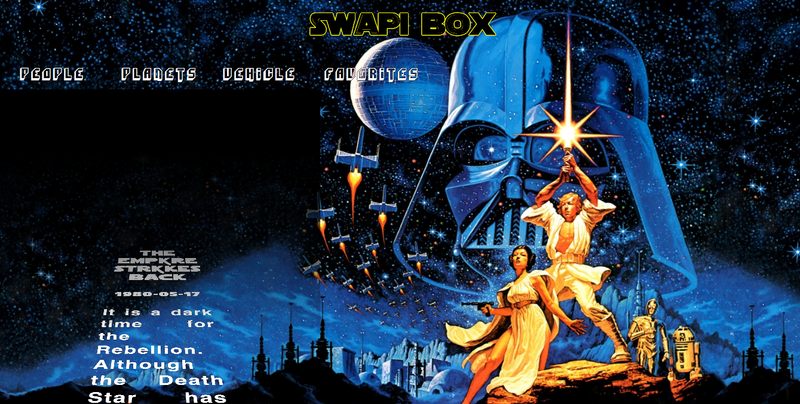
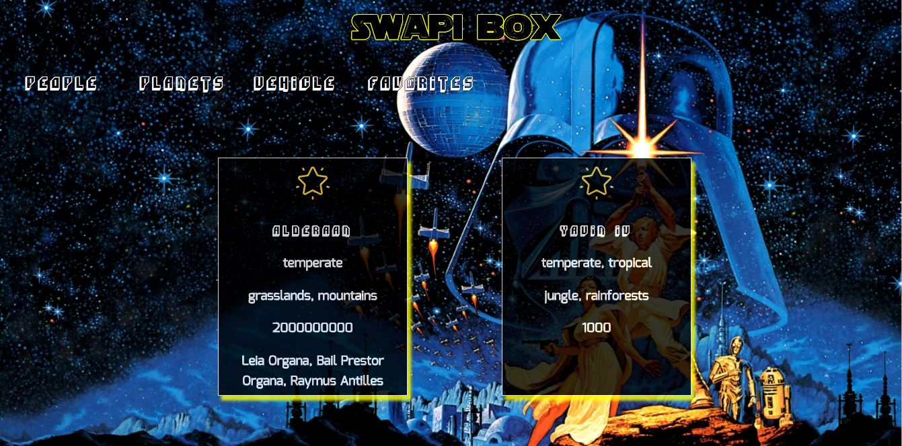

### This project focuses on displaying data from the Star Wars api using nested API calls, and is build with React utilizing reusable, modular components.

## Homepage:

##Planets Example:

## Contributors
[Valentino Valentine]https://github.com/valentinovtino/SwapiBox

_(**Turing School of Software & Design Front-end Engineering project - Mod 3:** [SWapiBox Project Spec]
(http://frontend.turing.io/projects/swapi-box.html)
